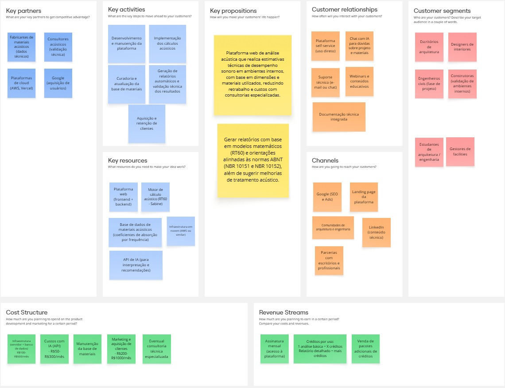
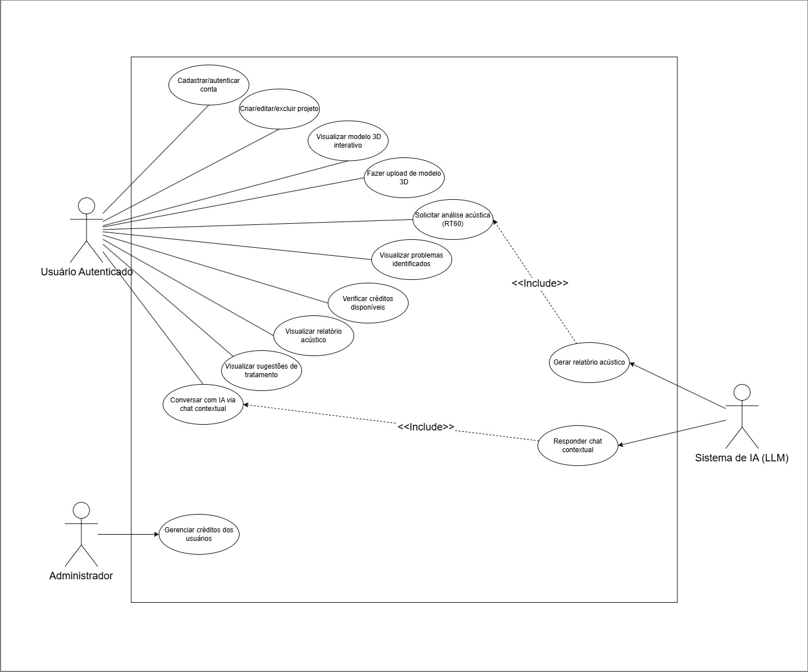

# Especificação do projeto

## Modelo de negócio (*Business Model Canvas*)

## Personas

| # | Nome | Perfil | Dores | Objetivos |
|---|------|--------|-------|-----------|
| 1 | **Marina Costa** — Arquiteta Autônoma | 32 anos, 8 anos de experiência, usa SketchUp e AutoCAD diariamente, não tem formação em acústica | Clientes reclamam de eco e reverberação após entrega dos projetos; ferramentas acústicas são caras e complexas | Analisar o comportamento acústico dos ambientes antes de finalizar o projeto, sem precisar contratar um especialista |
| 2 | **Carla Oliveira** — Estudante de Arquitetura (7º período) | 23 anos, usa Revit no curso, interesse em sustentabilidade e conforto ambiental, alta afinidade com tecnologia | Não tem acesso a softwares acústicos profissionais; dificuldade em embasar tecnicamente as escolhas de materiais nos projetos | Usar uma ferramenta gratuita para enriquecer seus projetos acadêmicos com dados técnicos de conforto acústico |
| 3 | **Bruno Tavares** — Gerente de Facilities em Empresa de TI | 40 anos, responsável por escritórios corporativos, pouca familiaridade com projetos de arquitetura, foco em resultados | Escritórios com alto nível de ruído reduzem produtividade da equipe; não sabe como comunicar o problema para o arquiteto contratado | Ter um diagnóstico simples e visual dos problemas acústicos para embasar decisões e briefings com fornecedores |

---

## Histórias de usuários

| # | Eu como... | Quero/Preciso... | Para... |
|---|------------|------------------|---------|
| US01 | Marina (Arquiteta) | Cadastrar um projeto com as dimensões e materiais do ambiente | Obter uma análise acústica automatizada antes de finalizar o projeto |
| US02 | Rafael (Produtor Musical) | Receber sugestões de materiais de tratamento acústico | Escolher os produtos certos sem desperdício financeiro |
| US03 | Carla (Estudante) | Visualizar o modelo 3D do ambiente diretamente no navegador | Enriquecer a apresentação do meu trabalho acadêmico com dados visuais |
| US04 | Bruno (Gerente) | Ver um relatório claro com os problemas acústicos identificados | Comunicar as necessidades ao arquiteto e justificar o investimento em reformas |
| US05 | Marina (Arquiteta) | Salvar e acessar múltiplos projetos | Gerenciar diferentes clientes e comparar cenários de tratamento |
| US06 | Rafael (Produtor) | Conversar com uma IA sobre as especificidades do meu estúdio | Obter respostas personalizadas que levem em conta o estilo musical e o uso do espaço |
| US07 | Carla (Estudante) | Exportar o relatório acústico em PDF | Incluir o documento no portfólio e na entrega acadêmica |
| US08 | Bruno (Gerente) | Acessar a plataforma sem instalação de software | Usar a ferramenta de qualquer computador corporativo sem burocracia de TI |
| US09 | Administrador | Gerenciar créditos e planos dos usuários | Garantir a sustentabilidade financeira da plataforma |

## Requisitos

### Requisitos funcionais

> **Técnica de Priorização utilizada: MoSCoW** (Must have / Should have / Could have / Won't have)
> A técnica foi aplicada com base nas histórias de usuário levantadas, priorizando funcionalidades que cobrem as dores centrais das personas principais (Marina e Rafael).

| ID | Descrição | Prioridade |
|----|-----------|------------|
| RF01 | O sistema deve permitir cadastro e autenticação de usuários via e-mail e senha | Must have |
| RF02 | O sistema deve permitir autenticação via Google (OAuth) | Should have |
| RF03 | O usuário deve poder criar, editar e excluir projetos acústicos | Must have |
| RF04 | O sistema deve aceitar as dimensões do ambiente (comprimento, largura, altura) | Must have |
| RF05 | O usuário deve poder selecionar materiais para parede, piso e teto a partir de uma biblioteca | Must have |
| RF06 | O sistema deve calcular o RT60 médio e por faixa de frequência (125Hz a 4kHz) | Must have |
| RF07 | O sistema deve gerar um relatório acústico automático utilizando IA | Must have |
| RF08 | O sistema deve listar os problemas acústicos identificados com severidade e localização | Must have |
| RF09 | O sistema deve apresentar sugestões de tratamento com prioridade e estimativa de custo | Must have |
| RF10 | O usuário deve poder fazer upload de modelos 3D (.glb, .gltf, .obj, .fbx, .skp, .rvt) | Should have |
| RF11 | O sistema deve exibir o modelo 3D carregado em um visualizador interativo no navegador | Should have |
| RF12 | O usuário deve poder conversar com uma IA sobre o projeto via chat contextual | Should have |
| RF13 | O sistema deve implementar um limite de créditos diários por usuário | Must have |
| RF14 | O sistema deve exportar o relatório acústico em formato PDF | Could have |
| RF15 | O administrador deve poder visualizar métricas de uso da plataforma | Could have |
| RF16 | O sistema deve exibir histórico de análises por projeto | Should have |

### Requisitos não funcionais

| ID | Descrição | Categoria | Prioridade |
|----|-----------|-----------|------------|
| RNF01 | A aplicação deve ser responsiva e funcionar em dispositivos móveis e desktops | Usabilidade | Must have |
| RNF02 | O tempo de resposta da análise acústica não deve ultrapassar 60 segundos | Desempenho | Must have |
| RNF03 | A plataforma deve estar disponível 99% do tempo (alta disponibilidade) | Confiabilidade | Should have |
| RNF04 | As senhas dos usuários devem ser armazenadas com hash seguro (bcrypt) | Segurança | Must have |
| RNF05 | O sistema deve utilizar HTTPS em todas as comunicações | Segurança | Must have |
| RNF06 | Os dados dos usuários devem ser protegidos por políticas de acesso (RLS) no banco de dados | Segurança | Must have |
| RNF07 | A interface deve ser acessível via navegador web sem necessidade de instalação | Portabilidade | Must have |
| RNF08 | O sistema deve suportar uploads de arquivos 3D de até 200MB | Desempenho | Should have |
| RNF09 | O sistema deve estar em conformidade com a LGPD (Lei Geral de Proteção de Dados) | Legal | Must have |

## Restrições

| # | Restrição |
|---|-----------|
| R01 | A aplicação será desenvolvida exclusivamente como plataforma web (sem apps nativos para iOS ou Android) |
| R02 | O cálculo de RT60 seguirá a fórmula de Sabine, sendo uma aproximação — não substitui medições acústicas presenciais |
| R03 | O sistema de IA depende de disponibilidade de APIs externas (LLM); instabilidades externas podem afetar a funcionalidade |
| R04 | O limite de créditos diários (5 análises/chat por dia) restringe o uso intensivo na versão gratuita |
| R05 | Arquivos nos formatos .skp e .rvt são recebidos para análise descritiva, mas não são renderizados em 3D no navegador por limitações de formato proprietário |
| R06 | A plataforma não realiza medições acústicas físicas reais — todas as análises são preditivas e baseadas nos dados inseridos pelo usuário |

## Diagrama de casos de uso

