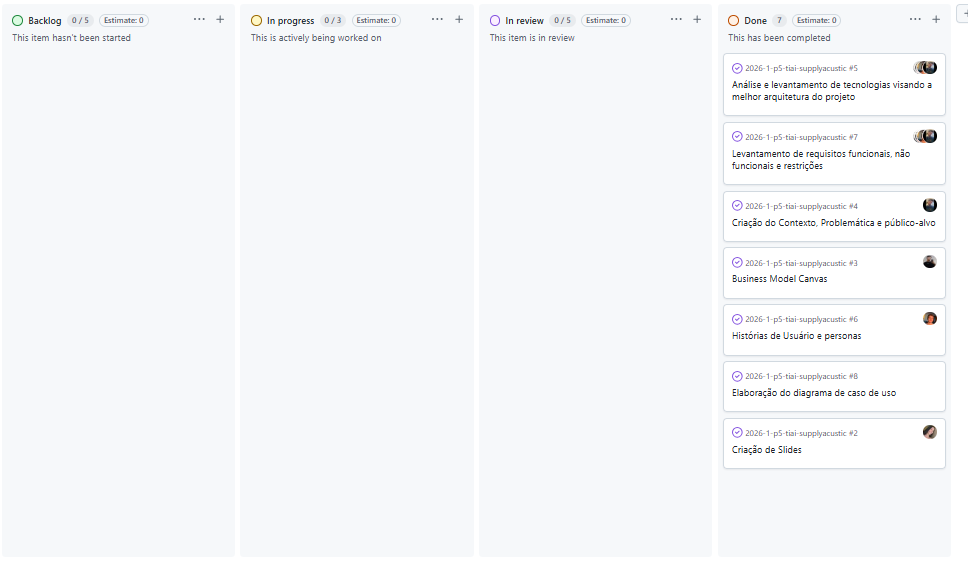
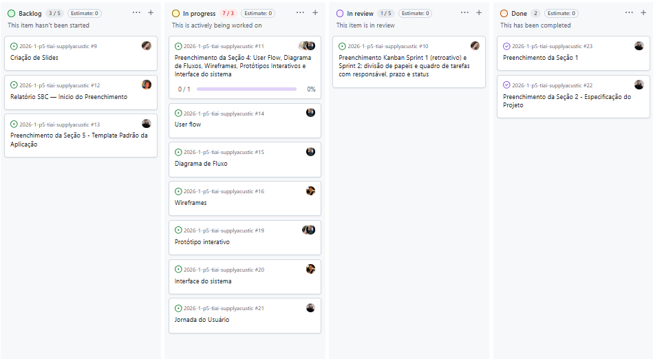

# Metodologia

O desenvolvimento do **SupplyAcustic** foi conduzido utilizando metodologias ágeis, com foco em entregas incrementais e validação contínua das funcionalidades junto aos requisitos levantados nas personas e histórias de usuário. A abordagem adotada permitiu evolução progressiva da solução, reduzindo riscos e garantindo aderência ao problema proposto de análise acústica acessível via web.

---

## Controle de versão

O controle de versão foi realizado com **Git**, utilizando o **GitHub** como repositório central.

### Estratégia adotada

- `main`: versão estável pronta para entrega
- `dev`: branch principal de desenvolvimento
- `feature/*`: desenvolvimento de novas funcionalidades (ex: `feature/rt60-calculo`)
- `bugfix/*`: correção de erros
- `hotfix/*`: correções críticas em produção

### Fluxo de trabalho

1. Criação de branch a partir da `dev`
2. Desenvolvimento da funcionalidade
3. Commit seguindo padrão semântico:
   - `feature:` nova funcionalidade
   - `fix:` correção de bug
   - `docs:` documentação
   - `refactor:` melhoria interna
4. Pull Request para `dev`
5. Code review por outro integrante
6. Merge após validação
7. Releases versionadas na `main` com tags (`v1.0`, `v1.1`)

### Issues

As issues foram utilizadas para organizar o backlog:

- `feature`: novas funcionalidades  
- `bug`: erros identificados  
- `enhancement`: melhorias  
- `documentation`: ajustes na documentação  

Cada issue foi vinculada a uma história de usuário, garantindo rastreabilidade com os requisitos.

---

## Planejamento do projeto

O projeto foi dividido em Sprints, seguindo o modelo Scrum, com foco em entregas incrementais.

### Divisão de papéis

#### Sprint 1 (Definição e modelagem)
- Scrum Master: Pedro Ferraz  
- Documentação: Kauan  
- Modelagem de negócio (Canvas + Personas): Manuela  
- Levantamento de requisitos: Alexandre  
- Validação técnica inicial: Caio  

#### Sprint 2 (Base da aplicação)
- Scrum Master: Caio  
- Front-end inicial: Pedro  
- Back-end inicial: Alexandre  
- Documentação: Manuela  
- Testes iniciais: Kauan

---

### Quadro de tarefas

#### Sprint 1

#### Sprint 2

## Processo

Foi adotado o **Scrum**, com ciclos curtos (Sprints de 1 a 2 semanas).

### Estrutura do processo

- **Backlog do produto** baseado nas histórias de usuário  
- **Planejamento da Sprint** definindo tarefas prioritárias  
- **Execução incremental**, focando nas funcionalidades críticas:
  - Cadastro de projetos
  - Cálculo de RT60
  - Geração de relatório com IA
- **Revisão da Sprint** com validação das entregas  
- **Retrospectiva** para melhoria contínua  

O acompanhamento foi feito via **GitHub Projects**, organizando tarefas em colunas:

- Backlog  
- Em andamento  
- Em revisão  
- Concluído  

Essa abordagem garantiu foco nas funcionalidades essenciais do sistema, como análise acústica preditiva e geração de relatórios inteligentes.

---

## Ferramentas

| Ambiente | Plataforma | Finalidade |
|--------|----------|------------|
| Repositório de código | GitHub | Versionamento e colaboração |
| Gerenciamento de tarefas | GitHub Projects | Organização das Sprints |
| Desenvolvimento front-end | React | Interface do usuário |
| Desenvolvimento back-end | Node.js + Vite | APIs e processamento |
| Banco de dados | PostgreSQL / Supabase | Armazenamento de dados |
| Inteligência Artificial | OpenAI API | Geração de relatórios |
| Visualização 3D | Three.js | Renderização de ambientes |
| Design de interface | Figma + Stitch | Prototipação |
| Hospedagem | A Definir | Deploy da aplicação |
