# Projeto de interface

 ## User flow

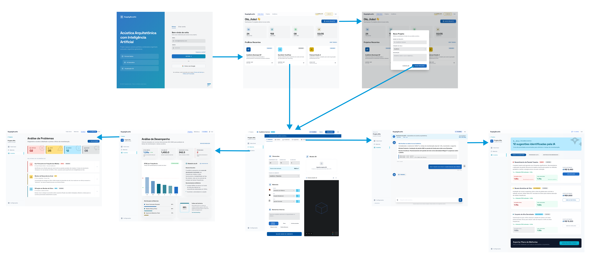

### Diagrama de fluxo

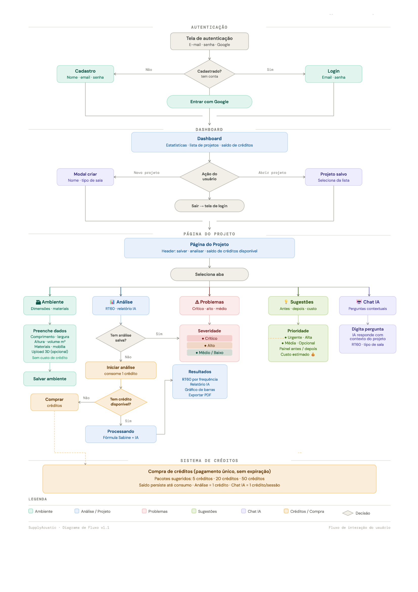
 
## Protótipo interativo

-  [Link para protótipo interativo](https://stitch.withgoogle.com/preview/4342309754974861042?node-id=8a4e2ecb25ca4baea32a9a1a27725379)

## Jornada do usuário

## Interface do sistema

### Tela Inicial (Landing Page)

A tela inicial apresenta a proposta de valor do SupplyAcoustic, destacando os principais benefícios da plataforma, funcionalidades disponíveis e chamada para cadastro ou login. Seu objetivo é apresentar a solução aos visitantes e converter usuários em clientes da plataforma.

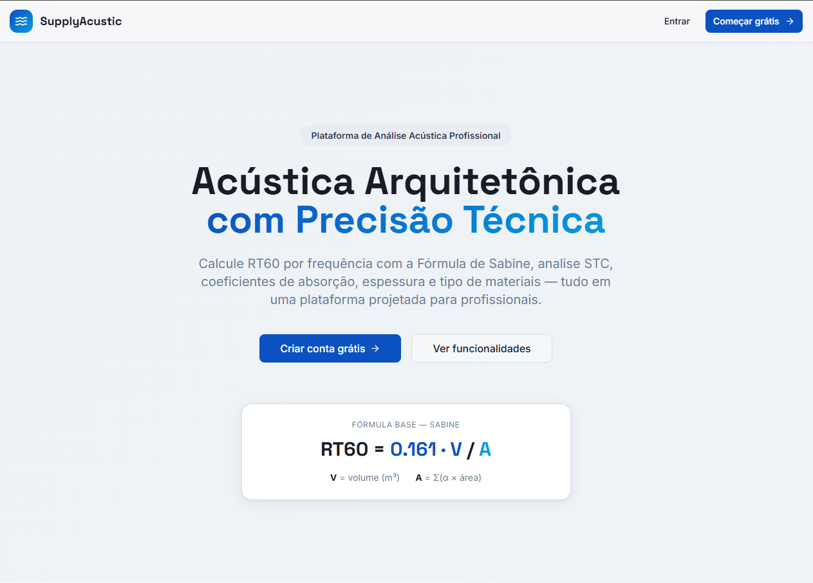

---

### Tela de Login

A tela de login permite que usuários cadastrados acessem suas contas através de credenciais de autenticação.

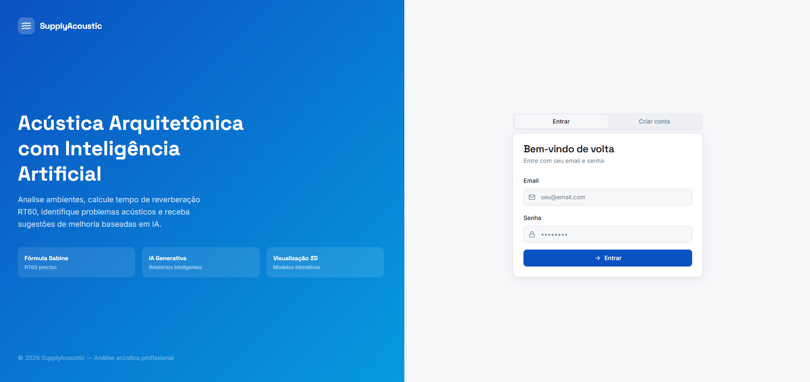

---

### Tela de Cadastro

A tela de cadastro permite que novos usuários criem uma conta na plataforma informando seus dados básicos para autenticação e utilização dos serviços.

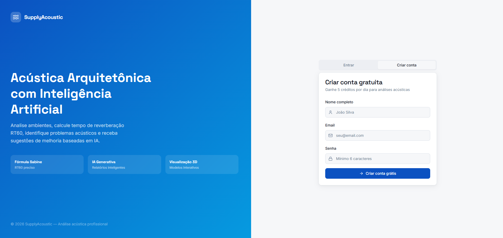

---

### Tela de Projetos

A tela de projetos permite visualizar, criar, editar e excluir projetos acústicos. Cada projeto representa um ambiente que poderá ser analisado pela plataforma.

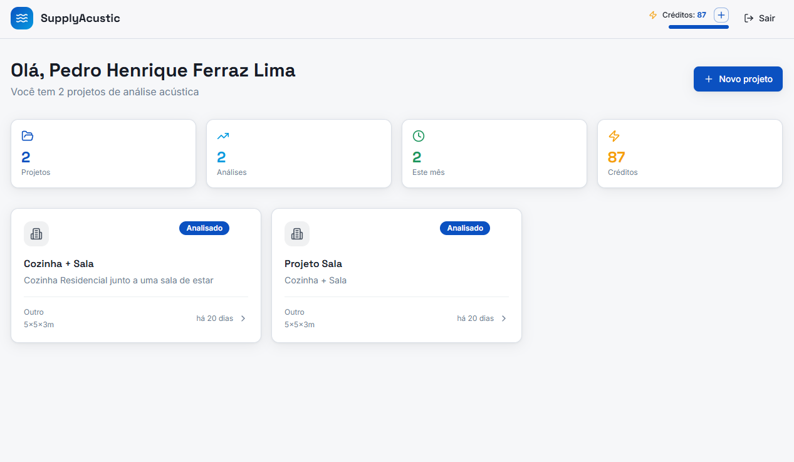

---

### Tela de Cadastro do Ambiente

Esta tela é utilizada para inserir um novo projeto informando qual modelo de ambiente será analizado

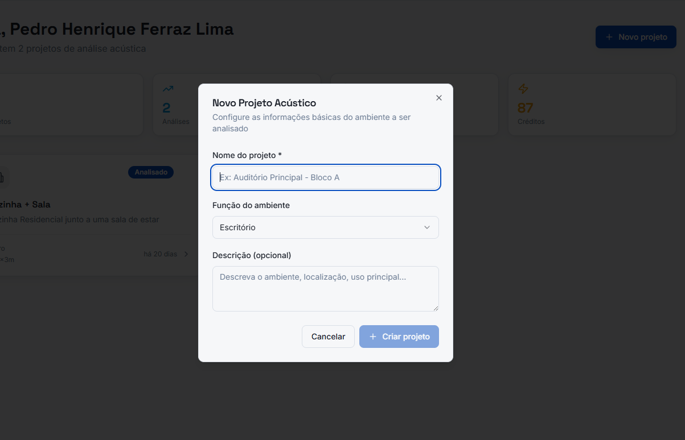

---

### Tela de Upload de dados

Permite ao usuário inserir informações sobre o projeto e enviar modelos tridimensionais do ambiente para visualizar a representação 3D diretamente na plataforma, facilitando a compreensão espacial do projeto.

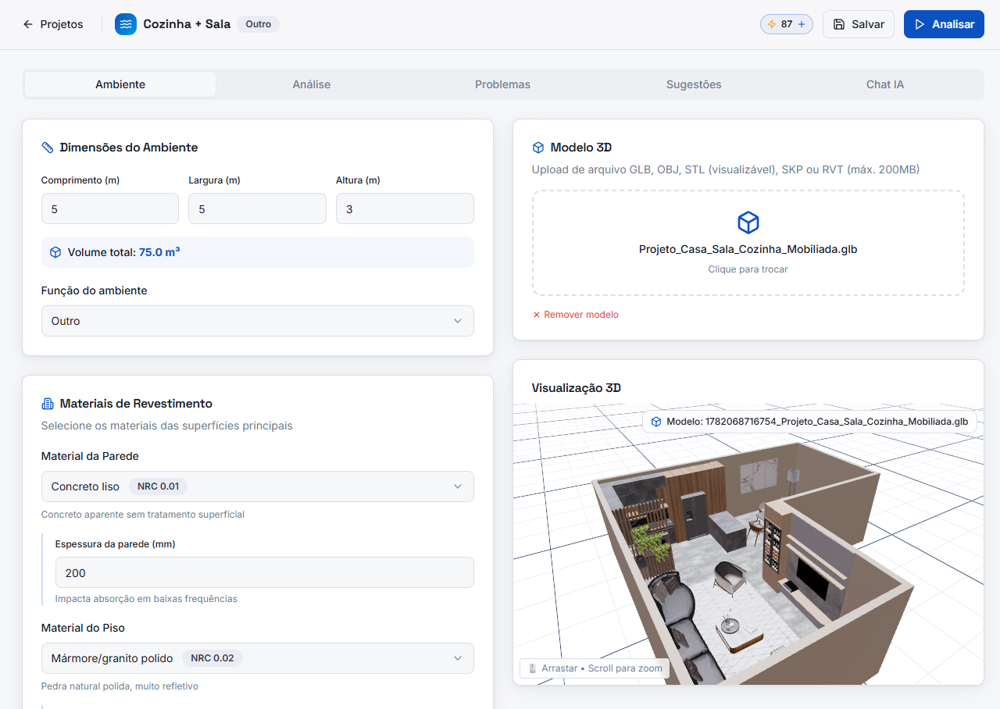

---

### Tela de Resultados

Apresenta os resultados obtidos após a análise, incluindo indicadores de tempo de reverberação (RT60) e gráficos comparativos

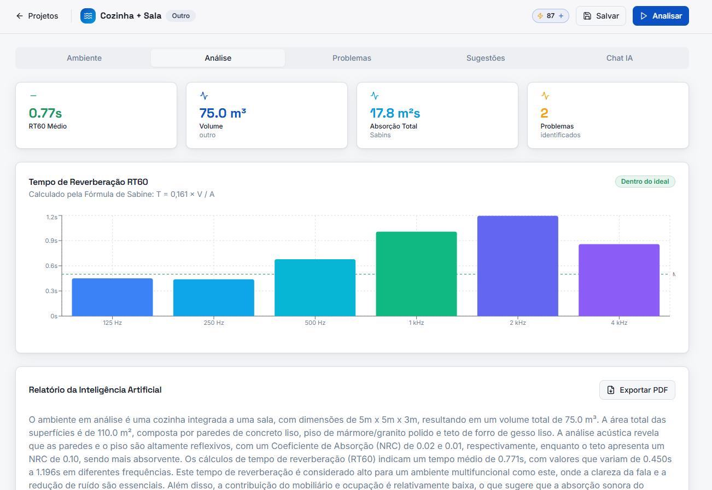

---

### Tela de Problemas Identificados

Exibe um relatório técnico gerado pela plataforma contendo diagnóstico de possíveis problemas com base na interpretação dos resultados.

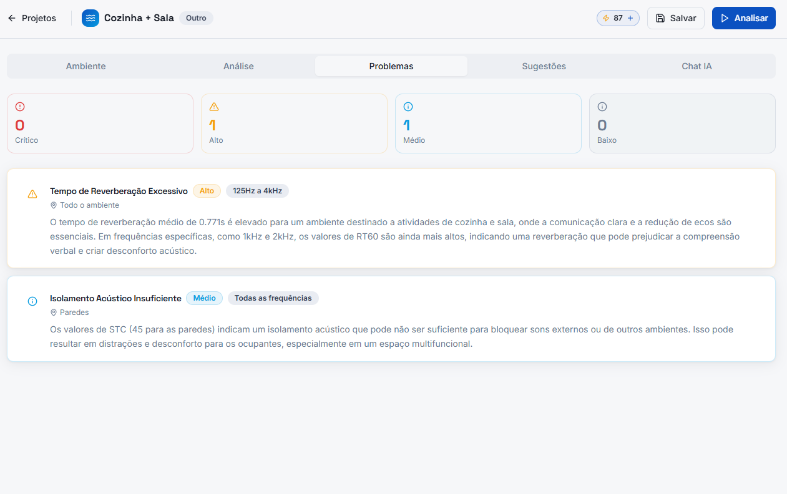

---

### Tela de Sugestões

Exibe o relatório técnico gerado pela plataforma contendo diagnóstico acústico, interpretação dos resultados e recomendações de melhorias para o ambiente analisado.

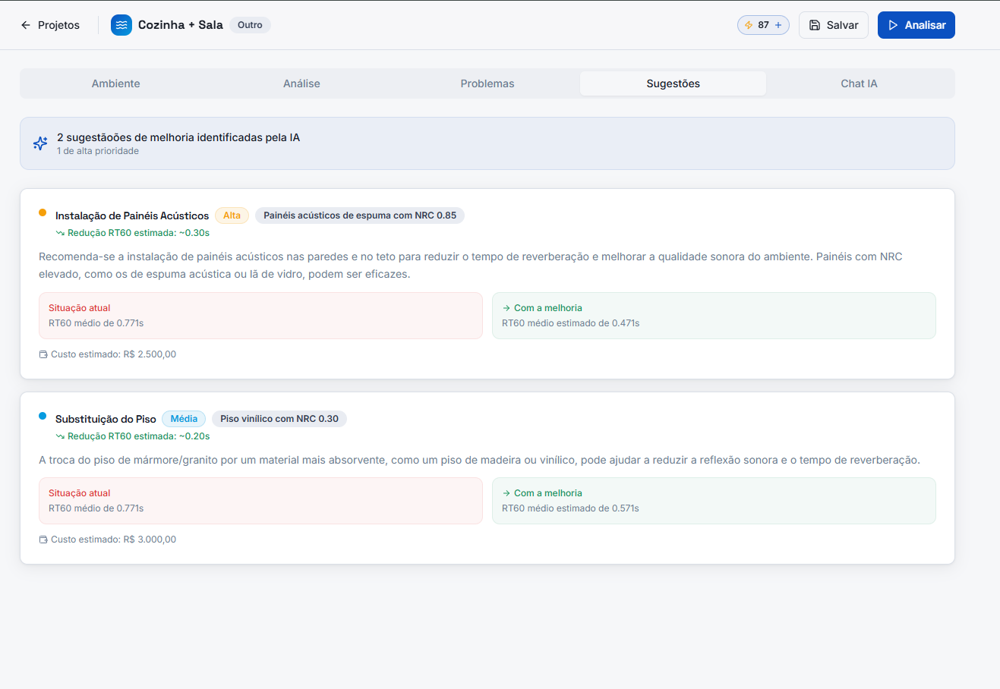

---

### Tela de Chat com Inteligência Artificial

Permite que o usuário interaja com a inteligência artificial da plataforma para esclarecer dúvidas sobre os resultados obtidos e receber orientações complementares relacionadas ao projeto.

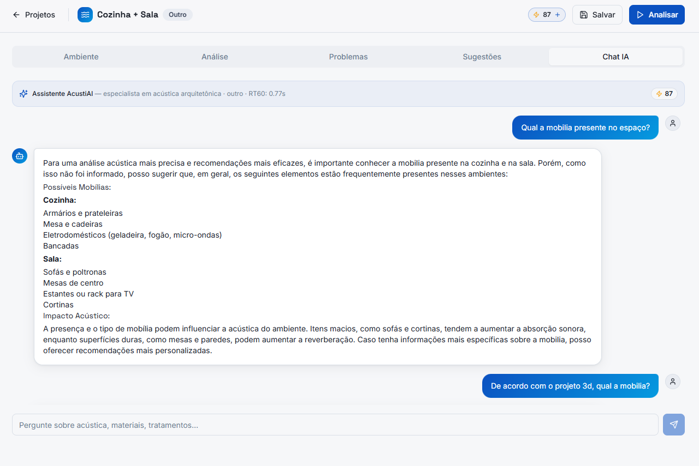

---