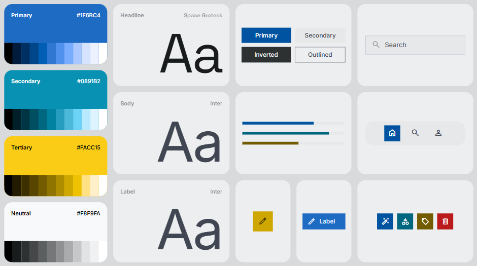

# Template padrão da aplicação

## Manual da Marca — SupplyAcustic

### Conceito da marca
A identidade visual do **SupplyAcustic** foi criada para transmitir tecnologia, precisão e acessibilidade no segmento de acústica arquitetônica.

O nome representa:

- **Supply** → solução e suporte  
- **Acustic** → análise acústica  

A proposta visual busca unir:

- Tecnologia  
- Engenharia  
- Arquitetura  
- Inteligência artificial  

---

### Paleta de cores

### Estilo visual
A interface segue um padrão minimalista com:

- Cards organizados  
- Botões arredondados  
- Ícones simples  
- Layout limpo  

---

### Justificativa visual
As escolhas visuais reforçam o posicionamento do SupplyAcustic como uma plataforma moderna, técnica e fácil de usar para profissionais que precisam realizar análises acústicas com mais rapidez.